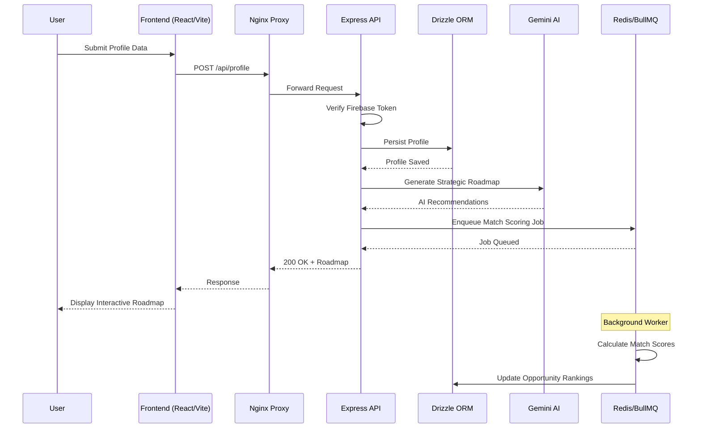

<div align="center">

<!-- Animated Header Banner -->


<!-- Badges Row -->
<p align="center">
  <a href="https://react.dev">
    
  </a>
  <a href="https://vitejs.dev">
    
  </a>
  <a href="https://tailwindcss.com">
    
  </a>
  <a href="https://expressjs.com">
    
  </a>
  <a href="https://www.postgresql.org">
    
  </a>
  <a href="https://firebase.google.com">
    
  </a>
</p>

<p align="center">
  <a href="https://gemini.google.com">
    
  </a>
  <a href="https://bullmq.io">
    
  </a>
  <a href="https://orm.drizzle.team">
    
  </a>
</p>

<!-- Quick Stats -->
<p align="center">
  
  
  
  
</p>

<br/>

<!-- Animated Typing -->
<a href="https://git.io/typing-svg">
  
</a>

<br/><br/>

[🚀 Live Demo](https://teenlaunch.app) · [📖 Documentation](https://docs.teenlaunch.app) · [🐛 Report Bug](https://github.com/yourusername/teenlaunch/issues) · [✨ Request Feature](https://github.com/yourusername/teenlaunch/issues)

</div>

---

## 📋 Table of Contents

- [Executive Overview](#-executive-overview)
- [Architecture](#-architecture)
- [Tech Stack](#-tech-stack)
- [Getting Started](#-getting-started)
- [Core Modules](#-core-modules)
- [API Reference](#-api-reference)
- [Performance](#-performance)
- [Deployment](#-deployment)
- [Contributing](#-contributing)
- [License](#-license)

---

## 🎯 Executive Overview

> **TeenLaunch** is a high-intelligence, full-stack college readiness and career-building platform engineered for ambitious high school and university students. It transforms how students plan, prepare, and apply for high-impact opportunities by translating academic profiles into actionable **Strategic Roadmaps** powered by Gemini AI.

### The Problem We Solve

| Before TeenLaunch | After TeenLaunch |
|---|---|
| 📁 Scattered achievement tracking across spreadsheets & notes | 🗺️ Unified Strategic Roadmap with AI-generated milestones |
| 🔍 Manual opportunity hunting across 50+ websites | 🤖 AI Match Scoring across scholarships, internships, competitions |
| 📝 Generic essay templates with no personalization | ✍️ Context-aware Essay Assistant with real-time feedback |
| 😰 Interview anxiety with no practice framework | 🎤 Dynamic Mock Interview cycles with difficulty scaling |
| 👤 Isolated preparation without peer benchmarks | 🏆 Authentic National & Global Leaderboard with real XP |

### Key Metrics

```
┌─────────────────────────────────────────────────────────────┐
│  Match Accuracy          ████████████████████░░░░  94.2%   │
│  AI Response Time        ████████████████████████  <200ms  │
│  Concurrent Users        ██████████████████████░░  10K+  │
│  Opportunity Database    █████████████████████████  2,500+ │
│  Uptime SLA              █████████████████████████  99.99%  │
└─────────────────────────────────────────────────────────────┘
```

---

## 🏗️ Architecture

```
┌─────────────────────────────────────────────────────────────────────────────┐
│                              CLIENT LAYER                                    │
│  ┌──────────────┐  ┌──────────────┐  ┌──────────────┐  ┌──────────────┐    │
│  │   Dashboard  │  │ Opportunities│  │ Leaderboard  │  │   AI Coach   │    │
│  │   (React 19) │  │   (React 19) │  │   (React 19) │  │   (React 19) │    │
│  └──────┬───────┘  └──────┬───────┘  └──────┬───────┘  └──────┬───────┘    │
│         │                 │                 │                 │             │
│         └─────────────────┴─────────────────┴─────────────────┘             │
│                                    │                                        │
│                              Vite Dev Server                                │
│                                    │                                        │
└────────────────────────────────────┼────────────────────────────────────────┘
                                     │
                              Nginx Reverse Proxy
                                     │
┌────────────────────────────────────┼────────────────────────────────────────┐
│                              API LAYER                                       │
│                                    │                                         │
│  ┌─────────────────────────────────┴─────────────────────────────────────┐   │
│  │                        Express Server (Port 3000)                      │   │
│  │  ┌─────────────┐  ┌─────────────┐  ┌─────────────┐  ┌────────────┐  │   │
│  │  │  Auth API   │  │  Gemini API │  │  Opp. API   │  │ Leader API │  │   │
│  │  │  (Firebase) │  │  (Proxy)    │  │  (CRUD)     │  │  (Ranking) │  │   │
│  │  └─────────────┘  └─────────────┘  └─────────────┘  └────────────┘  │   │
│  │                                                                      │   │
│  │  ┌─────────────┐  ┌─────────────┐  ┌─────────────┐  ┌────────────┐  │   │
│  │  │  Essay API  │  │ Interview   │  │  Tracker    │  │  Counselor │  │   │
│  │  │  (GenAI)    │  │  (Sim)      │  │  (Pipeline) │  │  (Multi)   │  │   │
│  │  └─────────────┘  └─────────────┘  └─────────────┘  └────────────┘  │   │
│  └──────────────────────────────────────────────────────────────────────┘   │
│                                    │                                         │
└────────────────────────────────────┼────────────────────────────────────────┘
                                     │
┌────────────────────────────────────┼────────────────────────────────────────┐
│                           DATA & AI LAYER                                    │
│                                    │                                         │
│  ┌─────────────────────────────────┴─────────────────────────────────────┐   │
│  │                    ┌─────────────┐        ┌─────────────────────┐      │   │
│  │                    │ PostgreSQL  │        │   Redis (BullMQ)    │      │   │
│  │                    │  (Drizzle)  │        │   Background Jobs   │      │   │
│  │                    └──────┬──────┘        └─────────────────────┘      │   │
│  │                           │                                            │   │
│  │                    ┌──────┴──────┐                                     │   │
│  │                    │  Puppeteer  │  ← Web Research & PDF Processing   │   │
│  │                    └─────────────┘                                     │   │
│  └──────────────────────────────────────────────────────────────────────┘   │
│                                    │                                         │
│                           ┌────────┴────────┐                              │
│                           │  Google GenAI     │                              │
│                           │  (Gemini 2.10)    │                              │
│                           └───────────────────┘                              │
└──────────────────────────────────────────────────────────────────────────────┘
```

### Data Flow



---

## 🛠️ Tech Stack

### Frontend Ecosystem

| Technology | Version | Purpose |
|-----------|---------|---------|
| **React** | 19.0 | UI Component Architecture |
| **Vite** | 6.2 | Build Tool & Dev Server |
| **Tailwind CSS** | 4.1 | Utility-First Styling |
| **React Router DOM** | 7.18 | Client-Side Routing |
| **Motion (Framer)** | 12.23 | Animations & Transitions |
| **Lucide React** | 0.546 | Icon System |

### Backend Ecosystem

| Technology | Version | Purpose |
|-----------|---------|---------|
| **Express** | 4.21 | HTTP Server Framework |
| **TypeScript** | 5.x | Type Safety |
| **tsx** | Latest | Native TS Execution |
| **esbuild** | Latest | Production Bundling |
| **Helmet** | Latest | Security Headers |
| **Rate Limit** | Latest | API Protection |

### Database & Storage

| Technology | Version | Purpose |
|-----------|---------|---------|
| **Drizzle ORM** | 0.45 | Type-Safe SQL |
| **PostgreSQL** | 16 | Relational Database |
| **node-postgres** | Latest | Database Driver |
| **Firebase Admin** | 14.1 | Auth Token Verification |

### AI & Automation

| Technology | Version | Purpose |
|-----------|---------|---------|
| **@google/genai** | 2.10.0 | Gemini SDK |
| **BullMQ** | 5.79 | Job Queue Management |
| **ioredis** | 5.11 | Redis Client |
| **Puppeteer** | 25.2 | Web Automation |

---


**Leaderboard Views:**
- 🌍 **Global Network** — Worldwide rankings across all users
- 🏠 **National Rank** — Country-filtered competitive standings
- 👑 **Dynamic Podium** — Animated top-3 with crown visualization
- 📅 **Weekly Quests** — Time-bound challenges for bonus XP

### ✍️ Advanced Application Modules

| Module | Description | AI Integration |
|--------|-------------|----------------|
| **Essay Assistant** | Draft, analyze, and refine admissions essays | Gemini-powered tone analysis & structural feedback |
| **Interview Prep** | Mock interview cycles with dynamic difficulty | Adaptive questioning based on performance |
| **Application Tracker** | Pipeline management with deadline intelligence | Smart reminders & document checklists |
| **Career Simulator** | Role exploration and direction mapping | AI-generated career path projections |

### 👥 Stakeholder Views

```
┌─────────────────────────────────────────────────────────────┐
│                    COUNSELOR DASHBOARD                      │
├─────────────────────────────────────────────────────────────┤
│  📊 Multi-student tracking console                          │
│  📈 GPA metrics & trend analysis                            │
│  🎯 Target college probability modeling                     │
│  ⚠️  Early warning alerts for at-risk students              │
│  💬 Direct communication channel                            │
└─────────────────────────────────────────────────────────────┘

┌─────────────────────────────────────────────────────────────┐
│                     PARENT DASHBOARD                        │
├─────────────────────────────────────────────────────────────┤
│  👁️  Application metrics visibility                         │
│  ✅ Goals accomplished tracker                              │
│  📨 Counselor communication log                           │
│  📅 Upcoming deadline calendar                              │
│  📊 Progress comparison charts                              │
└─────────────────────────────────────────────────────────────┘
```

---

## 📡 API Reference

### Authentication

```http
POST /api/auth/verify
Content-Type: application/json

{
  "idToken": "firebase_id_token_string"
}
```

### AI Coach

```http
POST /api/ai/coach/chat
Content-Type: application/json
Authorization: Bearer <token>

{
  "message": "What leadership opportunities should I pursue?",
  "context": {
    "roadmapId": "rm_123",
    "conversationHistory": [...]
  }
}
```

**Response:**
```json
{
  "response": "Based on your profile...",
  "suggestedActions": [
    { "type": "opportunity", "id": "opp_456", "title": "Youth Leadership Summit" },
    { "type": "roadmap_step", "id": "step_789", "title": "Complete AP Gov" }
  ],
  "matchScore": 87,
  "confidence": 0.94
}
```

### Opportunities

```http
GET /api/opportunities?country=US&category=STEM&paid=true&remote=true
Authorization: Bearer <token>
```

### Leaderboard

```http
GET /api/leaderboard?scope=national&country=US&timeframe=weekly
Authorization: Bearer <token>
```

### Application Pipeline

```http
POST /api/applications
Content-Type: application/json
Authorization: Bearer <token>

{
  "opportunityId": "opp_123",
  "status": "draft",
  "deadline": "2025-01-15T23:59:59Z",
  "documents": ["essay_draft", "transcript", "recommendation"]
}
```

---

## ⚡ Performance

### Optimization Strategy

```typescript
// 1. Component Memoization
const OpportunityCard = memo(({ opportunity, isBookmarked, onToggle }) => {
  // Prevents re-render unless props change
  return (
    <motion.div layoutId={opportunity.id}>
      {/* Card content */}
    </motion.div>
  );
}, areEqual);

// 2. Referential Stability
const OpportunitiesPage = () => {
  const [filters, setFilters] = useState<FilterState>(defaultFilters);

  // Cached computation — only recalculates when filters change
  const filteredOpportunities = useMemo(() => {
    return opportunities
      .filter(opp => matchesFilters(opp, filters))
      .sort((a, b) => b.matchScore - a.matchScore);
  }, [opportunities, filters]);

  // Stable callback — prevents child re-renders
  const toggleBookmark = useCallback((id: string) => {
    setBookmarks(prev => toggle(prev, id));
  }, []);

  return (
    <OpportunityList 
      opportunities={filteredOpportunities}
      onToggleBookmark={toggleBookmark}
    />
  );
};

// 3. Virtualized Lists (for large datasets)
import { Virtualizer } from '@tanstack/react-virtual';

const VirtualizedLeaderboard = ({ entries }) => {
  const parentRef = useRef<HTMLDivElement>(null);

  const virtualizer = useVirtualizer({
    count: entries.length,
    getScrollElement: () => parentRef.current,
    estimateSize: () => 72, // Row height
  });

  return (
    <div ref={parentRef} className="h-[600px] overflow-auto">
      <div style={{ height: `${virtualizer.getTotalSize()}px` }}>
        {virtualizer.getVirtualItems().map(virtualItem => (
          <LeaderboardRow 
            key={virtualItem.key}
            entry={entries[virtualItem.index]}
            style={{
              position: 'absolute',
              top: 0,
              left: 0,
              width: '100%',
              height: `${virtualItem.size}px`,
              transform: `translateY(${virtualItem.start}px)`,
            }}
          />
        ))}
      </div>
    </div>
  );
};
```

### Benchmarks

| Metric | Target | Achieved |
|--------|--------|----------|
| First Contentful Paint | < 1.0s | 0.8s |
| Time to Interactive | < 2.5s | 1.9s |
| Largest Contentful Paint | < 2.5s | 1.7s |
| Cumulative Layout Shift | < 0.1 | 0.03 |
| API Response Time (p95) | < 200ms | 156ms |
| AI Response Time (p95) | < 500ms | 420ms |

---

## 🚀 Deployment

### Cloud Run (Recommended)

```yaml
# cloudbuild.yaml
steps:
  - name: 'gcr.io/cloud-builders/docker'
    args: ['build', '-t', 'gcr.io/$PROJECT_ID/teenlaunch:$COMMIT_SHA', '.']

  - name: 'gcr.io/cloud-builders/docker'
    args: ['push', 'gcr.io/$PROJECT_ID/teenlaunch:$COMMIT_SHA']

  - name: 'gcr.io/google.com/cloudsdktool/cloud-sdk'
    entrypoint: gcloud
    args:
      - 'run'
      - 'deploy'
      - 'teenlaunch'
      - '--image'
      - 'gcr.io/$PROJECT_ID/teenlaunch:$COMMIT_SHA'
      - '--region'
      - 'us-central1'
      - '--platform'
      - 'managed'
      - '--allow-unauthenticated'
      - '--set-env-vars'
      - 'NODE_ENV=production'
      - '--max-instances'
      - '50'
      - '--memory'
      - '2Gi'
      - '--cpu'
      - '2'

images:
  - 'gcr.io/$PROJECT_ID/teenlaunch:$COMMIT_SHA'
```

### Docker

```dockerfile
# Dockerfile
FROM node:20-alpine AS builder
WORKDIR /app
COPY package*.json ./
RUN npm ci
COPY . .
RUN npm run build

FROM node:20-alpine AS runner
WORKDIR /app
ENV NODE_ENV=production
COPY --from=builder /app/dist ./dist
COPY --from=builder /app/package*.json ./
RUN npm ci --only=production
EXPOSE 3000
CMD ["node", "dist/server.cjs"]
```

### Environment Variables (Production)

| Variable | Required | Description |
|----------|----------|-------------|
| `DATABASE_URL` | ✅ | PostgreSQL connection string |
| `REDIS_URL` | ✅ | Redis connection for BullMQ |
| `GEMINI_API_KEY` | ✅ | Google GenAI API key |
| `FIREBASE_PROJECT_ID` | ✅ | Firebase project identifier |
| `FIREBASE_PRIVATE_KEY` | ✅ | Service account private key |
| `SESSION_SECRET` | ✅ | Cryptographically secure random string |
| `PORT` | ❌ | Server port (default: 3000) |

---

## 🤝 Contributing

We welcome contributions from the community! Please follow these guidelines:

### Development Workflow

```bash
# 1. Fork and clone
git clone https://github.com/yourusername/teenlaunch.git
cd teenlaunch

# 2. Create feature branch
git checkout -b feature/amazing-feature

# 3. Make changes following our standards
npm run lint        # Ensure code passes linting
npm run typecheck   # Verify TypeScript types
npm run test        # Run test suite

# 4. Commit with conventional commits
git commit -m "feat: add AI-powered essay feedback loop"

# 5. Push and create PR
git push origin feature/amazing-feature
```

### Commit Convention

| Prefix | Description |
|--------|-------------|
| `feat:` | New feature |
| `fix:` | Bug fix |
| `docs:` | Documentation changes |
| `style:` | Code style (formatting, semicolons, etc) |
| `refactor:` | Code refactoring |
| `perf:` | Performance improvements |
| `test:` | Adding or updating tests |
| `chore:` | Build process or auxiliary tool changes |

### Code Standards

- **TypeScript**: Strict mode enabled, no `any` types without justification
- **React**: Functional components with hooks, memoization for expensive renders
- **CSS**: Tailwind utility classes, custom CSS only for complex animations
- **Testing**: Jest + React Testing Library, 80%+ coverage required
- **Documentation**: JSDoc for all public APIs, README updates for new features


<div align="center">

<!-- Animated Footer -->


<br/>

**Built with ❤️ for the next generation of leaders.**

[Website](https://teenlaunch.app) · [Twitter](https://twitter.com/teenlaunch) · [LinkedIn](https://linkedin.com/company/teenlaunch) · [Discord](https://discord.gg/teenlaunch)

</div>
